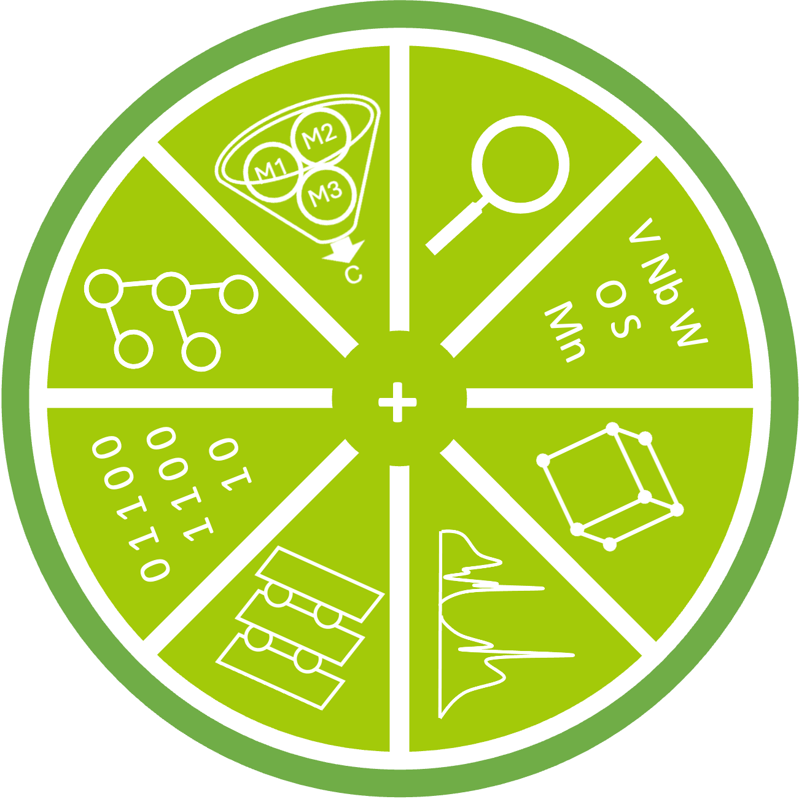

# LIEME
<div align="center">
    
</div>
<br>

🍋 LIEME: **Li**-ion **I**ntercalation **E**lectrode **M**aterials **E**xploration.

LIEME is an open source python package for discovering new Li intercalation electrode materials.

1. 🖥️ The computational framework maps first principles derived input features to experimentally measured performance for electrode materials using automated machine learning.
2. 📥 The input features for materials can be obtained from manual density functional theory (DFT) calculations, or from [Materials Project via the API](https://next-gen.materialsproject.org/api).
2. ⚠️ Usually, electrode material datasets which contain experimental performance data are small (< 100 datapoints). There is high risk of overfitting. To prevent this, only `min(f,int(0.1*d))` features should be considered for training, where f is the total number of features and d is the number of datapoints. This ensures less than 10% feature-data ratio as recommended in this [paper](https://advanced.onlinelibrary.wiley.com/doi/abs/10.1002/aenm.202200553).
2. 🚄 Models are trained on all feature subsets. This results in `combinations(f,int(0.1*d))` models. Each model explores different subspace of the feature space.
2. 📊 Final performance is obtained by averaging the predictions from all high-performing models.
2. ⚙️ The training process is automated using [TPOT](https://github.com/EpistasisLab/tpot?tab=readme-ov-file) and heavily parallelizable (for example, using SLURM array jobs, where each job is for training one model).
2. 💾 All the models are stored in an SQLite database.

# Installation
LIEME requires Python 3.11 or newer.

Install the latest stable build using the following command.
```
pip install lieme
```

If you want the latest developement version, clone the repo and install in editable mode.
```
git clone https://github.com/sreeharshab/lieme.git
cd lieme
pip install -e .
```

After installation, you can import LIEME in Python.
```
import lieme
```

LIEME depends on several scientific packages, which will be installed automatically when using pip. To avoid dependency conflicts with other packages, it is recommended to create a new conda environment and install LIEME using pip.

# Usage
## Obtaining Input Features by Parsing DFT Data
Input features can be generated for materials for which manual DFT data is available in the following directory structure.

material\
├── Energy_calculation\
├── Electronic_calculation\
├── Bader_calculation\
├── Intercalation\
&emsp;&emsp;&emsp;├── n_Li\
&emsp;&emsp;&emsp;&emsp;&emsp;&emsp; ├── Site\
&emsp;&emsp;&emsp;&emsp;&emsp;&emsp;&emsp;&emsp;&emsp; ├── geo_opt\
&emsp;&emsp;&emsp;&emsp;&emsp;&emsp;&emsp;&emsp;&emsp; ├── dos\
&emsp;&emsp;&emsp;&emsp;&emsp;&emsp;&emsp;&emsp;&emsp; ├── bader

n in n_Li is a positive integer. Site can be replaced with any custom name. An example of the directory structure is provided in the [`example`](./example/) directory.

```
from lieme.featurize import get_material_features

materials = [material]
X = get_material_features(materials=materials)
```

## Obtaining Input Features from Materials Project
Input features can also be generated for materials in Materials Project.
```
from lieme.mpfetch import FetchMaterials

fetcher = FetchMaterials(api_key="MATERIALS PROJECT API KEY")
X = fetcher.get_material_features()
```

When fetching materials from Materials Project, `standard_constraints` are passed to filter results. You can add additional constraints using `custom_constraints`. `standard_constraints` can also be switched off by passing `standard_constraints=False` to `get_material_features()`.

## Machine Learning
Machine learned models can be generated and used according to the following procedure.
```
from lieme.ml import MaterialsEchemRegressor

regressor = MaterialsEchemRegressor()
regressor.generate_train_jobs(n_features=4)
regressor.train(job_id=10)
```

`generate_train_jobs()` generates `jobs.pkl` which contains feature subset tuples such as `(feature_name_1, feature_name_2, feature_name_3, feature_name_4)`. For example, if the total number of features are 20, then `combinations(20,4)` which is 4845 tuples are present in `jobs.pkl`. Then, `train(job_id)` can train the model with the feature subset corresponding to the `job_id`. After training, the job_id, best model, feature subset and the cross validation score of the best model are saved to an SQLite database.
```
regressor.write_train_results_to_db()
```

The performance of new materials can be predicted after training the models.
```
predictions = regressor.test()
```

Make sure you have `X_train`, `Y_train` and `X_test` as .pkl files when you run the code mentioned above. If not, pass in `X_train` and `Y_train` in `train()` and `X_test` in `test()`.

For advanced usage, refer to the detailed documentation in the respective modules.